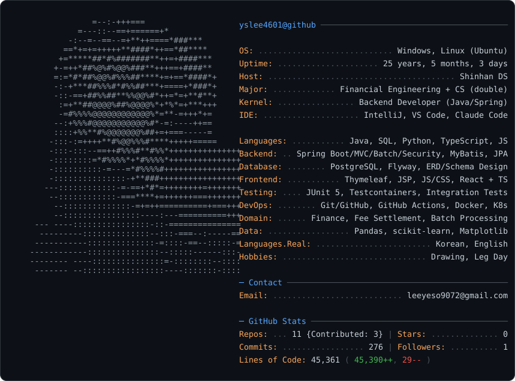

<picture>
  <source media="(prefers-color-scheme: dark)" srcset="dark_mode.svg">
  <source media="(prefers-color-scheme: light)" srcset="light_mode.svg">
  
</picture>

### 🛠 Skills

| 분야 | 기술 | 근거 |
|---|---|---|
| **Backend** | Java 21, Spring Boot, Spring MVC, Spring Batch, Spring Security, MyBatis, JPA | [FGC](https://github.com/feegachu/fgc) 정산 배치·인증 구현 / 신한DS 백엔드 1·2·3 |
| **Database** | PostgreSQL, SQL, Flyway 마이그레이션, ERD·스키마 설계, NoSQL 기초 | FGC 마이그레이션 47본·매퍼 47본 / 데이터베이스·DB 프로그래밍·DB와 NoSQL |
| **Testing** | JUnit 5, Testcontainers, 통합 테스트, 성능 테스트 | FGC 테스트 181개 / 단위·통합·성능테스트 과정 |
| **DevOps** | Git/GitHub, GitHub Actions CI, Docker Compose, Kubernetes | FGC CI 파이프라인 / Kubernetes DevOps 부트캠프 |
| **Frontend** | Thymeleaf, JSP/Servlet, JavaScript/CSS, React, TypeScript | FGC 화면 / 웹 프론트엔드 1·2 |
| **Domain** | 보험 수수료 정산, 분급·환수·대사, 1200% 규제 검증, 파생상품·재무관리 | FGC / 금융공학 1·2·3, 금융수치해석, 파생상품이론 |
| **Data** | Python, Pandas, scikit-learn, Matplotlib | 빅데이터 분석·기계학습·데이터분석과 시각화 |
| **OS** | Windows, Linux (Ubuntu) | 리눅스 프로그래밍, 운영체제 |

### 🤝 How I work

- **테스트와 CI로 안정성을 증명합니다.** FGC는 JUnit 5 테스트 181개를 Testcontainers 위에서 돌리고, GitHub Actions CI를 통과한 PR만 병합합니다.
- **규제 조문을 코드까지 추적합니다.** 1200% 규제 검증은 요구사항명세서·규제조문표·ERD에 근거 ID(REG/SRC)를 붙여 관리하고, 근거 없는 수정은 하지 않습니다.
- **PR과 리뷰로 협업합니다.** 팀 PR 183개 중 본인 병합 PR 50개, 타인 PR 리뷰 26건, 이슈 발제 55건, 커밋 252개.
- **금융 도메인을 이해하고 개발합니다.** 금융공학 전공 위에 수수료 산정·분급·환수·대사 로직을 직접 구현했습니다.

### 📌 Featured

**[FGC — 보험 수수료 정산 플랫폼](https://github.com/feegachu/fgc)**
GA 보험대리점의 수수료 산정·분급·환수·대사와 1200% 규제 검증을 지원하는 정산 시스템.
Spring Boot · Spring Batch · MyBatis · PostgreSQL · Thymeleaf · Testcontainers · GitHub Actions

<b>🎓 Education</b> — 금융공학 본전공 · 컴퓨터공학 복수전공

**금융공학**
금융기초수학 1·2 · 수리금융의 이해 1·2 · 금융공학 1 · 금융수치해석 · 재무관리 · 파생상품이론 1

**수학**
이산수학 · 확률론 · 해석학개론 · 수학기초론 · 미분방정식 · 고등 미적분학 · 선형대수학

**컴퓨터공학**
C언어 1·2 · 프로그래밍 기초 · 고급 프로그래밍 · 공학설계입문 · 자료구조 · 알고리즘 · 소프트웨어 공학 · 논리회로 · 운영체제 · 리눅스 프로그래밍 · 안드로이드 프로그래밍

**데이터베이스 · 데이터 · ML**
데이터베이스 · 데이터베이스 프로그래밍 · 데이터베이스와 NoSQL · 빅데이터이해 및 기획 · 빅데이터 분석 · 빅데이터 분석 실습 · 빅데이터 플랫폼 · 데이터분석과 시각화 · 기계학습

<b>🏦 Shinhan DS</b> — 금융 IT 개발자 양성 과정

**Java · Web**
웹 구조 및 원리 · 자바 프로그래밍 에센셜 · 자바 객체 지향 프로그래밍 · 웹 프론트엔드 1 (JSP, Thymeleaf) · 웹 프론트엔드 2 (React, TypeScript)

**Backend**
백엔드 프로그래밍 1 (JSP, Servlet, MVC) · 백엔드 프로그래밍 2 (Spring Framework, MyBatis) · 백엔드 프로그래밍 3 (Spring Boot, JPA) · 데이터베이스 설계 및 SQL 활용 · 단위테스트 · 통합테스트 · 성능테스트

**DevOps · Collaboration**
효율적인 협업과 생산성 도구 활용 (Git, GitHub) · Kubernetes DevOps 부트캠프

**Finance**
금융공학 1·2·3

**Projects**
- 스프링 MVC 활용 온라인 쇼핑/예약 서비스 구축
- DevOps 기반 스프링부트 · React 활용 금융 서비스 구축 → [FGC](https://github.com/feegachu/fgc)

